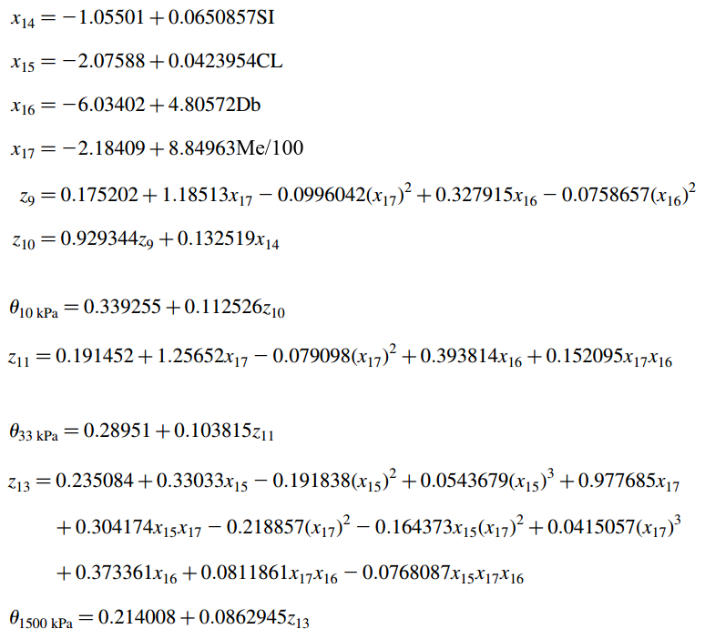

```{r setup, include=FALSE}
knitr::opts_chunk$set(echo = TRUE, collapse = TRUE)
```

>**Critérios de Avaliação**
>
> A lista vale 10 pontos. O peso de cada questão é 10/#questões.
>
> A entrega da lista deve seguir o [padrão](https://ead06.proj.ufsm.br/course/view.php?id=44385) de nomes dos arquivos conforme indicado no moodle. (Penalização de 0.5% do valor da lista)
>
> O arquivo Rmd deve ser identificado. (Penalização de 0.5% do valor da lista)
>
> A entrega em formato .Rmd era de incentivar a prática do R Markdown nos enunciados das questões. Por isso penalizou-se até 0.5% do valor da lista quando o aspecto da impressão no html diferiu muito do esperado (lista do livro).
>
> Os códigos são avaliados quanto as boas práticas recomendadas no [livro](https://lhmet.github.io/adar-ebook/boas-pr%C3%A1ticas-para-c%C3%B3digos-de-boa-qualidade.html). Penalização de até 5% do valor questão.
>
> Erros de digitação no texto são verificados, uma vez que foi mostrado no curso como evitá-los (ver [verificação ortográfica no RStudio](https://lhmet.github.io/adar-ebook/verifica%C3%A7%C3%A3o-ortogr%C3%A1fica.html)). Penalização de até 5% do valor questão. 
>
> Reprodutibilidade: o arquivo .Rmd deve rodar sem problemas e gerar o arquivo html com as respostas das questões. Penalização de até 5% do valor questão.
>
> Organização: a resolução das questões devem ser feitas no espaço reservado para ela, ou seja, logo abaixo do enunciado da referida questão no arquivo .Rmd.


##### 1. Execute as seguintes expressões no R mostrando os resultados obtidos.

```{r}

(var1 <- 1 + 1)
(var2 <- 100:130)
(var3 <- 5 - +1)
(var4 <- 3 %% 5) # esperava-se um comentário sobre a edição do conteúdo original (%)
(var5 <- 2 * 3)
(var6 <- 4 - 1)
(var7 <- 6 / (4 - 1))
```

```{r jdt-correcao1, echo = FALSE, comment="JDT>"}
# penalizacoes
p1 <- 0.01
# nota questão 1
(nq1 <- 1 - p1)
```

---

##### 2. Utilize uma expressão para cada item. 

a. <font size="3"> Escolha um número e some 3 a ele.

b. <font size="3"> Multiplique o resultado por 2.

c.  <font size="3"> Subtraia 10 da resposta.

d.  <font size="3"> Divida o que foi obtido por 4.

```{r}
(var8 <- 3 + 3) # número escolhido + 3
(var9 <- 2 * var8) # resposta letra b
(var10 <- var9 - 10) # resposta letra c
(var11 <- var10 / 4) # resposta letra d
```

>Seria mais adequado criar uma variável somente para o número escolhido pois é a única coisa que poderia variar. As demais operações não variam, então para que nomeá-las?

>JDT: Veja as boas práticas sobre comentários:
>
https://lhmet.github.io/adar-ebook/r-no-modo-interativo.html#comentarios.
>
https://lhmet.github.io/adar-ebook/boas-pr%C3%A1ticas-para-c%C3%B3digos-de-boa-qualidade.html
> Comentar o porquê, ao invés de o que.

```{r jdt-correcao2, echo = FALSE, comment="JDT>"}
# penalizacoes
p2 <- 0.01 + 0.05
# nota questão 2
(nq2 <- 1 - p2)
```


---

##### 3. Calcule $\sqrt{16}$, $16^{{0.5}^3}$, $(16^{0.5})^3$ e $4^\frac{3}{2}$.

```{r}
(raiz <- sqrt(16))
(pot1 <- (16)^(0.5^3))
(pot2 <- (16^0.5)^3)
(pot3 <- 4^(3 / 2))
```
```{r jdt-correcao3, echo = FALSE, comment="JDT>"}
# penalizacoes
p3 <- 0
# nota questão 1
(nq3 <- 1 - p3)
```
---

##### 4. Teste as expressões `log10(1000)`, `log(1000)`, `exp(log(1000))`. Verifique se você entendeu as diferentes funções logarítmicas.

```{r}
(log_ex1 <- log10(1000)) #log de x = 1000 na base 10

(log_ex2 <- log(1000)) # log de x = 1000 na base = exp(1)

(log_ex3 <- exp(log(1000))) # log de uma exponencial

(log_ex4 <- log2(64)) # log de x = 64 na base 2
```

> Comentários desenecessários (poluição visual do código).  Se os comentários feitos no código referem-se a verificação de entendimento, eles deveriam estar como texto.

```{r jdt-correcao4, echo = FALSE, comment="JDT>"}
# penalizacoes
p4 <- 0.05 
# nota questão 1
(nq4 <- 1 - p4)
```

---

##### 5. Defina as variáveis abaixo tomando cuidados ao nomear as variáveis, conforme visto em sala de aula. **Mostre os valores para as seguintes constantes**:

a. <font size="3"> Velocidade da luz: $\nu ~=~2.998~\mathrm{x}~10^{8} \left [ ms^{-1} \right ]$

b. <font size="3"> Carga elementar ou eletrônica: 
$e~=~1.602~\mathrm{x}~10^{-19} \left [ C \right ]$

c. <font size="3"> Permissividade do vácuo: 
$\epsilon_{0}~=~8.85~\mathrm{x}~10^{-12}~\left [ C^{2}N^{-1}m^{2} \right ]$

d. <font size="3"> Constante de Planck: $h~=~6.626~\mathrm{x}~10^{-34}~\left [ Js\right]$

e. <font size="3"> Constante de Stefan Boltzman: 
$\sigma~=~5.67~\mathrm{x}~10^{-8}~\left [Wm^{-2}K{-4}\right]$ 

> Erro no expoente 4.

f. <font size="3"> Constante solar: $S_0~=~1380~\left [ Wm^{-2} \right ]$

g. <font size="3"> Constante de Avogadro: $N_A~=~6.022~\mathrm{x}~10^{23}\left [mol^{-1}\right ]$

h. <font size="3"> Constante dos gases para o ar seco: $R_d~=~287.04~[JK^{-1}kg^{-1}$

i. <font size="3"> Constante dos gases ideais para vapor: $R_w~=~461.5~[JK^{-1}kg^{-1}$

j. <font size="3"> Densidade do ar seco para CNTP (à 0°C em 1000 mb):
$\rho~=~1.2754~[kgm^{-3}]$

k. <font size="3"> Pressão média ao nível médio do mar para atmosfera padrão: 
$P_0~=~1013.25~[mb]$

l. <font size="3"> Temperatura ao nível médio do mar para atmosfera padrão: $T_0~=~288.15~[K]$

 m. <font size="3"> Calor latente de vaporização ou condensação (à 0 °C): $\lambda_v~=~2.501\mathrm{x}10^{6}~[Jkg^{-1}]$

n. <font size="3"> Calor latente de fusão (à 0 °C): 
$\lambda_f~=~0.334\mathrm{x}10^{6}~[Jkg^{-1}]$

> x é diferente de $\times$

o. <font size="3"> Massa molecular da água: $M_w~=~18.16\left [g~mol^{-1} \right ]$

p. <font size="3">  Peso molecular do ar: $M_{ar}~=~28.96\left [g~mol^{-1} \right ]$

q. <font size="3"> Raio da terra: $r~=~6.37~\mathrm{x}~10^{6}\left [ m \right ]$

r. <font size="3"> Velocidade angular da Terra: 
$\Omega~=~7.29~\mathrm{x}~10^{-5}~\left [rad~s^{-1} \right ]$

```{r}
# a.
vel_luz <- 2.988 * 10^{8}
# b
e <- 1.602 * 10^{-19}
# c.
e_0 <- 8.85 * 10^{-12}
# d.
planck <- 6.626 * 10^{-34}
# e.
boltz <- 5.67 * 10^{-8}
# f.
S_0 <- 1380
# g.
cte_avog <- 6.022 * 10^{23}
# h.
R_ars <- 287.04
# i.
R_vap <- 461.5
# j.
rho_ars <- 1.2754
# k.
p_0 <- 1013.25
# l.
T_0 <- 288.15
# m.
heat_lvap <- 2.501 * 10^6
# n.
heat_lfus <- 0.334 * 10^6
# o.
M_h2o <- 28.96
# p.
M_ar <- 28.96
# q.
R0 <- 6.37 * 10^{6}
# r.
vel_ang_Ter <- 7.29 * 10^{-5}
```

> Faltou boas práticas. Código com letras maiúsculas e '_' misturados. Recomendou-se adotar uma das 2 convenções para escrita de código: `tipo_cobra` ou `tipoCamelo`. Escolha uma e seja consistente. Isso facilita a legibilidade do código.

> Você não mostrou os valores das contantes (imprimir no console: veja as alternativas em https://lhmet.github.io/adar-ebook/variaveis.html). Leia os enunciados com atenção.

```{r jdt-correcao5, echo = FALSE, comment="JDT>"}
# penalizacoes
p5 <- 0.05 + 0.5 + 0.02
# nota questão 1
(nq5 <- 1 - p5)
```


---

##### 6. a. Como você pode fazer para que a constante $pi$ seja mostrada com 20 dígitos? (b) Como voltar a trabalhar a com 7 dígitos novamente? c. Mostre o número neperiano com 7 dígitos.

a) Para mostrar a constante $pi$ com 20 dígitos basta escrever:

```{r}
options(digits = 20)
(pi)
```

b) Para voltar a trabalhar com 7 dígitos, basta alterar o número no no argumento entre parênteses:

```{r}
options(digits = 7)
(pi)
```

c) Número neperiano com 7 dígitos:

```{r}
options(digits = 7)
(exp(1))
```

```{r jdt-correcao6, echo = FALSE, comment="JDT>"}
# penalizacoes
p6 <- 0.0
# nota questão 6
(nq6 <- 1 - p6)
```
---

##### 7. Determine a temperatura de bulbo úmido ($T_w$) usando a expressão empírica (Stull, 2011) abaixo. Salve os resultados em variáveis diferentes. Determine a $T_w$ para temperatura do ar $T~=~20~°C$ e Umidade relativa $UR~=~70~\%$ ? Defina variáveis para os valores de $T$ e $UR$ solicitados e substitua-os na equação de $T_w$. Não é necessária a conversão dos dados expressos em % para aplicação na equação.

$$
\begin{align*} 
T_w~=~T*atan[0.151977*(UR+8.313659)^{1/2}]+\\
atan(T+UR)-\\
atan(UR-1.676331)+\\
0.00391838(UR)^{3/2}*atan(0.023101*UR)-\\
4.686035
\end{align*}
$$

```{r}
Temp <- 20
um_rel <- 70

T_w <- Temp * atan(0.151977 * (um_rel + 8.313659)^{
  1 / 2
}) +
  atan(Temp + um_rel) -
  atan(um_rel - 1.676331) +
  0.00391838 * (um_rel)^{
    3 / 2
  } * atan(0.023101 * um_rel) -
  4.686035

options(digits = 7) #! desnecessário
(T_w) #! parênteses desnecessários
```

> Faltou boas práticas. Código com letras maiúsculas e '_' misturados. Recomendou-se adotar uma das 2 convenções para escrita de código: `tipo_cobra` ou `tipoCamelo`. Escolha uma e seja consistente. Isso facilita a legibilidade do código.

```{r jdt-correcao7, echo = FALSE, comment="JDT>"}
# penalizacoes
p7 <- 0.05
# nota questão 1
(nq7 <- 1 - p7)
```

- - -

##### 8. Determine os valores de umidade do solo:

* <font size="3"> no potencial hídrico de 10kPa ($\theta_{10kPa}$)

* <font size="3"> na capacidade de campo ($\theta_{33kPa}$)

* <font size="3"> no ponto de murcha permanente ($\theta_{1500kPa}$)

<font size="3"> utilizando o conjunto de equações de pedotransferência abaixo (Tomasela et al. 2003):


```{r, out.width = "60%"}
#
knitr::include_graphics("https://raw.githubusercontent.com/andradesmaicon/resolucao-lista1-adar/master/conj-eqs-tomasella2003.png")

```

> Ao invés do nome do arquivo, para fins de reprodutibilidade poderia ter colocado o link para a imagem no seu github.


```{r jdt-correcao8a, echo = FALSE, comment="JDT>"}
# penalizacoes
p8 <- 0.05
```


```{r}
si <- 16.29
cl <- 49.25
db <- 1.25
me <- 25

x14 <- -1.05501 + 0.0650857 * si

x15 <- -2.07588 + 0.0423954 * cl

x16 <- -6.03402 + 4.80572 * db

x17 <- -2.18409 + 8.84963 * me / 100

z9 <- 0.175202 + 1.18513 * x17 - 0.0996042 * (x17^2) + 0.327915 * x16 -
  0.0758657 * (x16^2)

z10 <- 0.929344 * z9 + 0.132519 * x14

theta10 <- 0.339255 + 0.112526 * z10

z11 <- 0.191452 + 1.25652 * x17 - 0.079098 * (x17^2) + 0.393814 * x16 +
  0.152095 * x17 * x16

theta33 <- 0.28951 + 0.103815 * z11

z13 <- 0.235084 + 0.33033 * x15 - 0.191838 * (x15^2) + 0.0543679 * (x15^3) +
  0.977685 * x17 + 0.304174 * x15 * x17 - 0.218857 * (x17^2) - 
  0.164373 * x15 * (x17^2) +
  0.0415057 * (x17^3) + 0.373361 * x16 + 0.0811861 * x17 * x16 -
  0.0768087 * x15 * x17 * x16

theta1500 <- 0.214008 + 0.0862945 * z13

# Umidade do solo no potencial hídrico de 10kPa
print(theta10)

# Umidade do solo na capacidade de campo
print(theta33)

# Umidade do solo no ponto de murcha permanente
print(theta1500)
```


```{r jdt-correcao8, echo = FALSE, comment="JDT>"}
# penalizacoes
p8 <- p8 + 0
# nota questão 1
(nq8 <- 1 - p8)
```

- - - 

##### 9. Arredonde para 2 casas decimais os resultados da questão 8. Dica ver `?round`.

```{r}
# theta10
(theta10 <- round(theta10, 2))
# theta33
(theta33 <- round(theta33, 2))
# theta1500
(theta1500 <- round(theta1500, 2))
```


```{r jdt-correcao9, echo = FALSE, comment="JDT>"}
# penalizacoes
p9 <- 0
# nota questão 1
(nq9 <- 1 - p9)
```

---

##### 10. Instale a **última versão do R** no (seu) computador usado para resolução desta lista. Crie um _script_ chamado `solucao-q10-NomeDoAluno.R` contendo os códigos gerados para solução das questões 7 e 8. Faça as seguintes alterações no código do _script_:

* <font size="3"> no código da questão 8, utilize a temperatura do ar ($T$) de 30°C e Umidade relativa ($UR$) de 30% para calcular $T_w$.

* <font size="3"> no código da questão 9, considere $SI=13$ (%), $CL~=~37$ (%), $Db~=~1.3~(gcm^{−3})$, $Me~=~21$ (%) para recalcular $\theta_{10kPa}$, $\theta_{33kPa}$, $\theta_{1500kPa}$.

* <font size="3"> após os códigos usados para resolver as questões 8 e 9, adicione uma nova linha com a expressão `sessionInfo()`.

* <font size="3"> Finalmente rode o _script_ usando o R no modo não iterativo. Anexe o arquivo de saída `solucao-q10-NomeDoAluno.Rout` como resposta para este problema.


```{r, error=TRUE}
source("https://raw.githubusercontent.com/andradesmaicon/resolucao-lista1-adar/master/solucao-q10-maicon.R", echo = TRUE)
```


> Não foi possível rodar seu script devido ao uso do `setwd()`. Evite de usar a `setwd()`  ele é desnecessário, pois a organização dos script deve ser tal que a análise referente ao script seja realizado dentro de um único diretório. Deixe comentado se você não 
pretende usar uma estrutura de projeto do RStudio. Ademais aonde você fosse reaizar essa análise não importaria, pois o conteúdo não depende de caminhos para acesso a dados. Você viu `setwd()` no início nos meus scripts de aula?


```{r jdt-correcao10, echo = FALSE, comment="JDT>"}
# penalizacoes
p10 <- 0.1
# nota questão 1
(nq10 <- 1 - p10)
```


```{r jdt-nota-final, comment = "JDT>", echo=FALSE, eval = TRUE}
# requer conexão de internet
source("https://gist.githubusercontent.com/lhmet/3ddfc43bcf796c81ecfd9bb93f5f5dc2/raw/b489a6bb4d948472afa5068256b7869a7997e109/aux-funs-list-correction")
coleta_notas
# verificação de autoria
nota <- round((sum(coleta_notas)/length(coleta_notas) * 10), 1)
message("Nota: ", nota)

```

